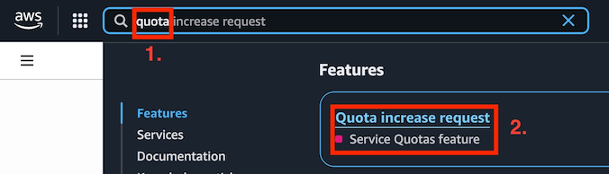
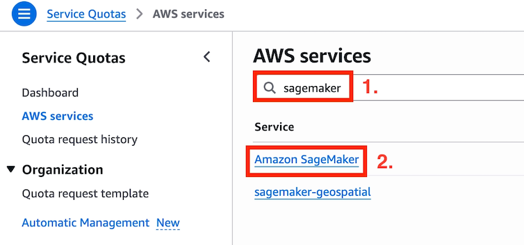
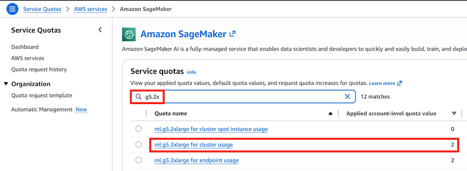

# Session 1: SageMaker HyperPod on Slurm 기본 세팅

## 개요

SageMaker HyperPod 클러스터를 구성하고 Slurm 환경을 세팅하는 방법을 학습합니다.

## 학습 목표

- SageMaker HyperPod 클러스터 아키텍처 이해
- Slurm 스케줄러 기본 개념 및 설정
- 클러스터 접속 및 기본 명령어 실습

## 필수 준비 사항

- AWS 실습 계정 (Workshop studio)
- 로컬 개발 환경 (개인 랩탑, 개발용 EC2 등)에 VS Code와 Remote Extension 설치
    - 참조: [https://velog.io/@jenori_dev/AWS-VS-Code에서-AWS-SSH-접속하기](https://velog.io/@jenori_dev/AWS-VS-Code%EC%97%90%EC%84%9C-AWS-SSH-%EC%A0%91%EC%86%8D%ED%95%98%EA%B8%B0)
- `ml.g5.2xlarge x 2ea` Quota - 자동으로 디폴트 quota가 2로 부여되어 있지만, 혹시 quota가 0이면 아래 URL을 참조해서 직접 Quota increase를 신청하기 바랍니다.
    - URL: https://console.aws.amazon.com/servicequotas/
    - Service: `Amazon SageMaker` / Quota Name: `ml.g5.2xlarge for HyperPod cluster usage`
    - AWS 메인 화면 상단 검색창에서 **quota**로 검색 후 `Quota increase request` 링크 클릭

## 실습 내용

- https://bit.ly/hyperpod-slurm